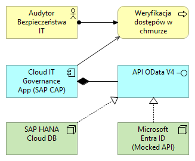

# Cloud IT Governance & Asset Monitor (PoC)

## 📝 O projekcie
Ten projekt to **Proof of Concept (PoC)** systemu do zarządzania uprawnieniami w chmurze. Stworzyłem go, aby pokazać, jak można połączyć świat programowania (SAP BTP) z profesjonalnym projektowaniem architektury (ArchiMate).

System pozwala na:
* Przechowywanie danych o pracownikach i ich poziomach dostępu do chmury.
* Automatyczną weryfikację tych danych przez API.
* Symulację integracji z systemami bezpieczeństwa klasy korporacyjnej.

## 🏛️ Architektura Systemu
Jako architekt, nie tylko napisałem kod, ale też zaprojektowałem schemat działania systemu zgodnie ze standardem **ArchiMate**.

### Co widać na schemacie?
1.  **Warstwa Biznesowa (Żółta):** Pokazuje proces, w którym Audytor sprawdza, czy pracownicy mają poprawne dostępy.
2.  **Warstwa Aplikacji (Niebieska):** To mój program stworzony w SAP CAP, który wystawia dane przez profesjonalne API (OData).
3.  **Warstwa Technologii (Zielona):** To fundamenty – baza danych SAP HANA oraz zewnętrzny system tożsamości.

## 🛠️ Wykorzystane Technologie
* **SAP BTP & CAP (Node.js):** Główny silnik aplikacji.
* **ArchiMate (Narzędzie Archi):** Do zaprojektowania profesjonalnego diagramu architektury.
* **Git & GitHub:** Do zarządzania wersjami kodu i dokumentacją.

## ⚖️ Decyzje Architektoniczne (ADR)
To najważniejsza sekcja dla rekrutera. Pokazuje, że rozumiem ograniczenia technologiczne i potrafię znaleźć rozwiązanie.

### 1. Dlaczego Microsoft Entra ID (Azure AD) jest "udawany" (Mocked)?
* **Problem:** Prawdziwa integracja z Microsoft Azure wymagałaby posiadania uprawnień Administratora Globalnego oraz rejestracji płatnej aplikacji w portalu Azure.
* **Rozwiązanie:** Zastosowałem tzw. **Mock Service** w Node.js. Napisałem kod, który "udaje" odpowiedź z serwerów Microsoftu.
* **Wniosek:** Dzięki temu system jest bezpieczny i gotowy do wdrożenia – wystarczy podmienić jeden adres URL w przyszłości, aby zaczął pobierać prawdziwe dane.

### 2. Wybór bazy danych In-memory
* **Decyzja:** Dane są przechowywane w pamięci operacyjnej (SQLite) na etapie testów.
* **Zaleta:** Pozwala to na błyskawiczne wprowadzanie zmian w strukturze pracowników bez czekania na długie procesy instalacji bazy danych.

## 🚀 Jak działa logika biznesowa?
W pliku `srv/admin-service.js` dodałem skrypt, który przy każdym odczycie danych pracownika dopisuje informację: `(Verified via Azure Mock)`. Jest to dowód na to, że system potrafi w locie łączyć dane z bazy z danymi z zewnętrznych systemów bezpieczeństwa.

---
*Projekt stworzony jako demonstracja umiejętności z zakresu SAP Cloud i Architektury IT.*
